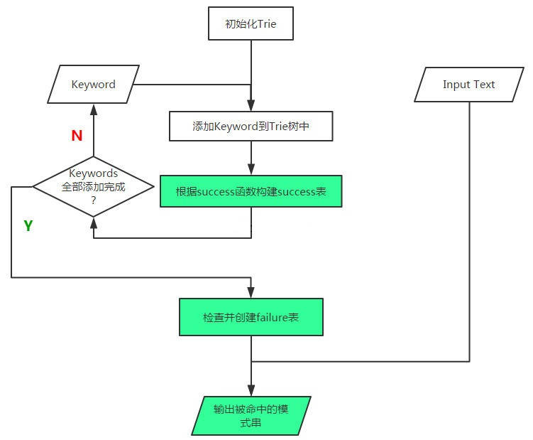

<div align="center">
<h1>ahoCorasick4cj</h1>
</div>

<p align="center">


</p>

## 介绍

使用 Aho-Corasick 字符串搜索算法，能够提供高效的字符串匹配功能

### 特性

- 🚀 支持多字符搜索
- 🚀 支持关键词库模式
- 🚀 支持自定义值输出模式

### 路线

<p align="center">

</p>

##  流程图

<p align="center">

</p>


### 源码目录

```shell
├── doc
│   ├── assets
│   ├── feature_api.md
├── src
│   ├── default_payload_emit_handler.cj
│   ├── emit.cj
│   ├── interval_node.cj
│   ├── interval_tree.cj
│   ├── interval.cj
│   ├── intervalable.cj
│   ├── payload_emit_handler.cj
│   ├── payload_emit.cj
│   ├── payload_state.cj
│   ├── payload_trie_builder.cj
│   ├── payload_trie.cj
│   ├── payload.cj
│   ├── stateful_payload_emit_handler.cj
│   ├── trie_builder.cj
│   ├── trie_config.cj
│   ├── trie.cj
└── test   
    ├── HLT
    ├── LLT
    └── UT
├── CHANGELOG.md
├── gitee_gate.cfg
├── LICENSE
├── module.json
├── README.md
├── README.OpenSource
```

- `doc` 存放库的设计文档、使用文档、需求文档、LLT 用例覆盖报告
- `src` 是库源码目录
- `test` 是存放测试用例的文件夹，含有 HLT 测试用例、LLT 自测用例和 UT 单元测试用例

### 接口说明

主要是核心类和成员函数说明,详情见 [API](./doc/feature_api.md)

##  使用说明

### 编译

1. <a id = "jump1">本项目编译运行方式<a>

-  <a id = "jump">引入 testJekins 包<a>

    ```
    git clone https://gitee.com/HW-PLLab/testJekins
    ```

    将 src 下 ci_test 放入 ahoCorasick4cj 根目录下,执行：

    ```
    cjpm clean
    cjpm update
    python3 ci_test/main.py build    ---> 编译
    python3 ci_test/main.py test     ---> 执行 test/LLT 用例
    ```
    test/LLT 用例书写参考：https://gitee.com/HW-PLLab/cangjie-library-pages/wikis 的门禁测试脚本使用方式

- 重复 [本项目编译运行方式的第二步](#jump)

### 多字符搜索功能示例

```cangjie
from ahoCorasick4cj import ahoCorasick4cj.*
from std import unittest.*
from std import unittest.testmacro.*

main(): Int64 {
    let charSearchTest03 = CharSearchTest01()
    charSearchTest01.testCharSearch01()
}

@Test
public class CharSearchTest01 {

    @TestCase
    public func testCharSearch01(): Unit {
        var builder = Trie.builder()
        var trie = builder.addKeyword("hers").addKeyword("his").addKeyword("she").addKeyword("he").build()
        var emits = trie.parseText("ushers")
        var iter = emits.iterator()
        for (i in iter) {
            println(i.toString())
        }
    }
}
```

执行结果如下：

```shell
1:3=she
2:3=he
2:5=hers
```

注意：用例需放入 `test/LLT` 下，执行步骤是 [本项目编译运行方式](#jump1)


##  参与贡献

欢迎给我们提交 PR，欢迎给我们提交 issue，欢迎参与任何形式的贡献。
